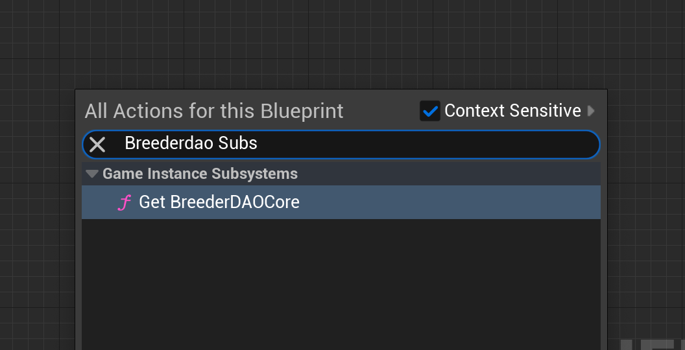
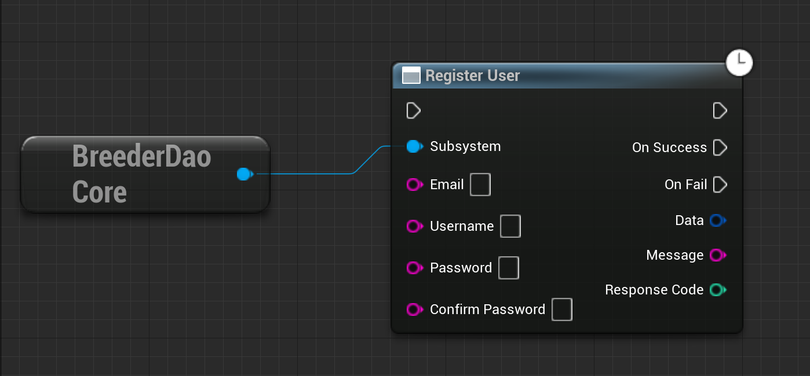
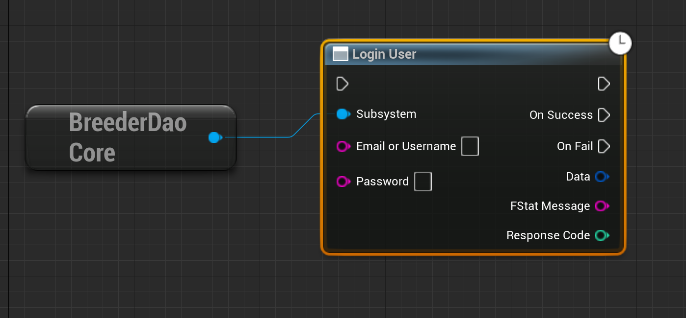

# Creatorverse Plugins Docs

## Installation

1. Request CreatorVerse UE plugins from the BreederDAO team.
2. Navigate to your root project directory. Create a new folder named Plugins and add the received plugins to this folder.
3. Open the Unreal Engine editor. You will be prompted to compile the plugin. Follow the on-screen instructions to complete the compilation process.

- Search for the BreederDAO subsystem.

## BreederDAO Blueprints

### Registration

This blueprint allows users to create a Creatorverse account.

**Input Pin:**

- Username
- Email
- Password
- Confirm Password

**Output Pin:**

- OnSuccess: The response pin triggered when registration is successful.
- OnFail: Triggered when an error is encountered during the API request.
- Data: The successful response data.
- Message: The error message. This pin can be empty when the response is successful.
- Response Code: The HTTP response code.

**Email Verification:**

After successfully registering, the user will receive a verification email. The user needs to click on the link in the email to verify their account. This step ensures that the provided email address is valid and accessible by the user.

## Login

Allows users to log in to the Creatorverse game.

**Pre-requisite:**

- The user must have previously registered.

**Input Pin:**

- Email or Username
- Password

**Output Pin:**

- OnSuccess: The response pin triggered when registration is successful.
- OnFail: Triggered when an error is encountered during the API request.
- Data: The successful response data.
- Message: The error message. This pin can be empty when the response is successful.
- Response Code: The HTTP response code.

**Note:** Upon successful login, a Bearer token will be generated. This token is essential for accessing other APIs within the Creatorverse ecosystem.
