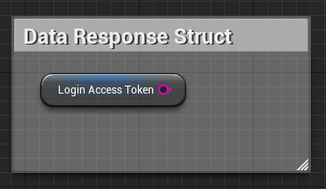
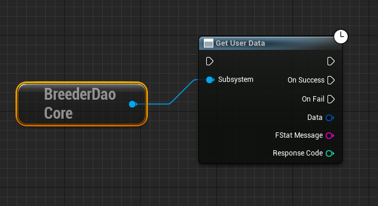
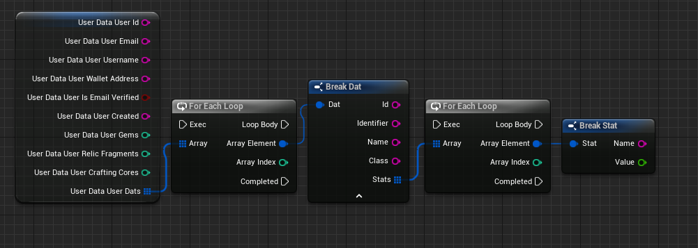
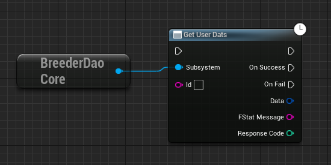
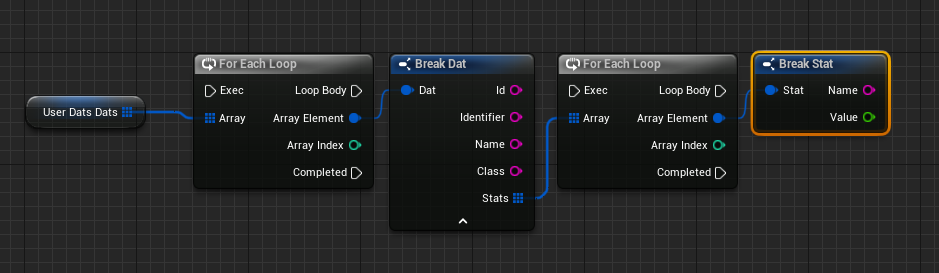
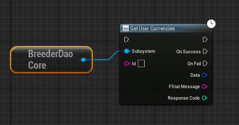
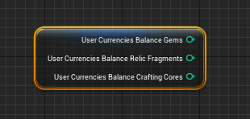

# Creatorverse Plugins Docs

## Base API Reference

**Base URL**
http://bdao-ecs-crtrvrs-wallet-api-dev-2122478437.ap-southeast-1.elb.amazonaws.com/api/v1

**Output Pin Structure for All Blueprints:**

- **OnSuccess:** Triggered upon a successful API request.
- **OnFail**: Triggered if an error occurs during the API request.
- **Data:** Holds data from a successful API request (only available when OnSuccess is activated).
- **Message:** Contains error message for a failed API request (populated when OnFail is triggered).
- **Response Code:** Indicates the HTTP response code received.

## Installation

1. Request CreatorVerse UE plugins from the BreederDAO team.
2. Navigate to your root project directory. Create a new folder named Plugins and add the received plugins to this folder.
3. Open the Unreal Engine editor. You will be prompted to compile the plugin. Follow the on-screen instructions to complete the compilation process.

- Search for the BreederDAO subsystem.

## BreederDAO Blueprints

### Registration

**Description:**

Enables users to create a Creatorverse account.

[API Reference:](http://bdao-ecs-crtrvrs-wallet-api-dev-2122478437.ap-southeast-1.elb.amazonaws.com/api/v1#/user/UserController_register)

**Input Pin:**

- Username
- Email
- Password
- Confirm Password

**Email Verification:**

Upon registration, users receive a verification email to confirm the validity of their email address.

### Login

**Description:**

Facilitates user login to the Creatorverse game.

**Pre-requisite:**

- User must be registered.

[API Reference:](http://bdao-ecs-crtrvrs-wallet-api-dev-2122478437.ap-southeast-1.elb.amazonaws.com/api/v1#/auth/AuthController_login)

**Input Pin:**

- Email or Username
- Password

**Data Struct:**

**Note:** Upon successful login, a Bearer token will be generated. This token is essential for accessing other APIs within the Creatorverse ecosystem.

### Get User Data

**Description:**

Retrieve user account data, including user information, DATs, and currency balances.

**Pre-requisite:**

- User must be logged in.

[API Reference:](http://bdao-ecs-crtrvrs-wallet-api-dev-2122478437.ap-southeast-1.elb.amazonaws.com/api/v1#/user/UserController_getUser)

**Data Struct:**

### Get User Dats

**Description:**

Fetch the current user’s DATs.

[API Reference:](http://bdao-ecs-crtrvrs-wallet-api-dev-2122478437.ap-southeast-1.elb.amazonaws.com/api/v1#/user/UserController_getUserDats)

**Data Struct:**

### Get User Currencies Balance

**Description:**

Retrieve the current user’s currency balances.

[API Reference:](http://bdao-ecs-crtrvrs-wallet-api-dev-2122478437.ap-southeast-1.elb.amazonaws.com/api/v1#/user/UserController_getUserCurrencies)

**Data Struct:**

